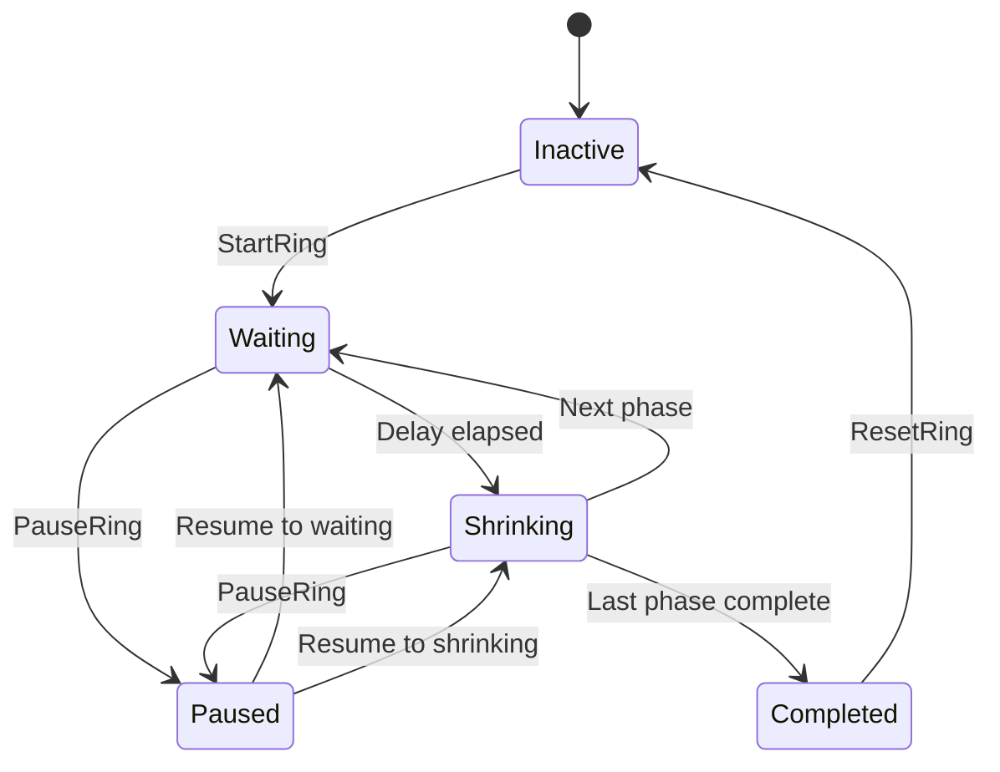
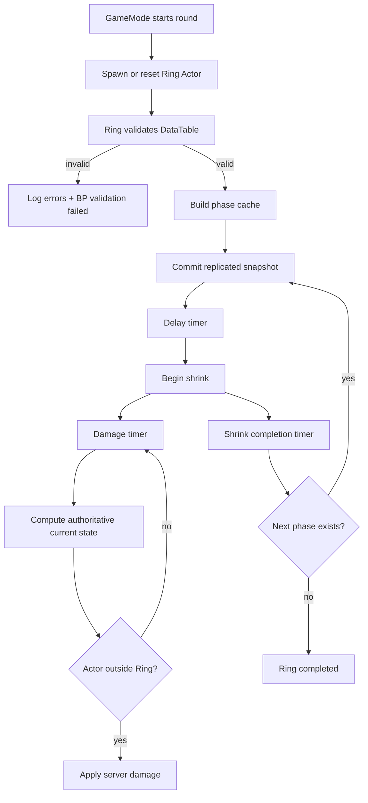

# Ring Component API Draft

Terminology note: this file keeps the historical `zone_component_api.md` filename for harness compatibility, but the implementation and user-facing term is `Ring`.

## Compact Implementation Summary

권장 구조는 현재 구현 기준으로 `AJunRingActor + UJunRingComponent`다.

- `AJunRingActor`: replicated actor, client-visible runtime snapshot owner
- `UJunRingComponent`: server authority core logic, phase progression, validation, damage
- GameMode: round orchestration only, starts/stops/resets Ring
- GameState: optional Ring actor reference and team/round state integration
- UI: GameMode가 아니라 Ring actor/component snapshot getter를 읽음

## API Specification

| API | Owner | Authority | Blueprint | Purpose |
|---|---|---:|---:|---|
| `InitFromDataTable(UDataTable* InTable, FName InRowName)` | Ring Component | Server | Yes | Initialize phase cache from DataTable |
| `InitFromPhaseRows(const TArray<FJunRingPhaseRow>& InRows)` | Ring Component | Server | Yes | Initialize directly from validated rows |
| `StartRing()` | Ring Component / Ring Actor | Server | Yes | Start ring phase progression |
| `StopRing()` | Ring Component / Ring Actor | Server | Yes | Stop active ring without resetting all config |
| `PauseRing()` | Ring Component / Ring Actor | Server | Yes | Pause progression and damage |
| `ResumeRing()` | Ring Component / Ring Actor | Server | Yes | Resume from paused state |
| `ResetRing()` | Ring Component / Ring Actor | Server | Yes | Reset runtime state to inactive |
| `ResetForRound()` | Ring Component / Ring Actor | Server | Yes | Round-specific reset wrapper |
| `AdvanceToPhase(int32 PhaseIndex)` | Ring Component | Server | Yes | Debug/admin phase jump |
| `GetCurrentRuntimeState() const` | Ring Actor | Client/Server | Yes | Return UI-safe snapshot |
| `IsRingActive() const` | Ring Actor / Component | Client/Server | Yes | Read active state |
| `IsShrinking() const` | Ring Actor / Component | Client/Server | Yes | Read shrinking state |
| `GetCurrentRadius() const` | Ring Actor / Component | Client/Server | Yes | Read current radius |
| `GetCurrentCenter() const` | Ring Actor / Component | Client/Server | Yes | Read current center |

## Server-Only Hooks

| Hook | Owner | Purpose |
|---|---|---|
| `ServerStartRingInternal()` | Ring Component | Guarded start path after authority check |
| `ServerApplyOutsideDamage()` | Ring Component | Damage tick for outside actors |
| `ServerRebuildPhaseCache()` | Ring Component | Build deterministic cache from DataTable or rows |
| `ServerCommitPhaseTransition()` | Ring Component | Write new phase snapshot and notify |

## Blueprint Hooks

| Hook | Type | Purpose |
|---|---|---|
| `BP_OnRingInitialized` | `BlueprintImplementableEvent` | Designer feedback when config is loaded |
| `BP_OnRingStarted` | `BlueprintImplementableEvent` | Start VFX/SFX/UI warning |
| `BP_OnRingPaused` | `BlueprintImplementableEvent` | Pause UI/VFX response |
| `BP_OnRingStopped` | `BlueprintImplementableEvent` | Stop UI/VFX response |
| `BP_OnRingPhaseChanged` | `BlueprintImplementableEvent` | Phase transition UI/VFX |
| `BP_OnRingCenterChanged` | `BlueprintImplementableEvent` | Minimap/world indicator update |
| `BP_OnRingRadiusChanged` | `BlueprintImplementableEvent` | Ring visual scale update |
| `BP_OnRingCompleted` | `BlueprintImplementableEvent` | Final phase complete response |
| `BP_OnRingDataValidationFailed` | `BlueprintImplementableEvent` | Designer-visible invalid data warning |
| `OnRingSnapshotChanged` | `BlueprintAssignable` | UI can bind to replicated snapshot changes |

## CSV Schema

| Column | Type | Required | Validation |
|---|---|---:|---|
| `Name` | RowName | Yes | Unique row key |
| `PhaseIndex` | int32 | Yes | Sequential from 0 |
| `Radius` | float | No | >= 0, defaults from previous target |
| `TargetRadius` | float | Yes | >= 0 |
| `WaitTime` | float | Legacy-compatible | Used when `DelayBeforeShrink < 0` |
| `DelayBeforeShrink` | float | No | >= 0, overrides `WaitTime` |
| `ShrinkTime` | float | Legacy-compatible | Used when `ShrinkDuration < 0` |
| `ShrinkDuration` | float | No | >= 0, overrides `ShrinkTime` |
| `DamageInterval` | float | Legacy-compatible | Used when `DamageTickInterval <= 0` |
| `DamageTickInterval` | float | No | > 0 when provided |
| `DamagePerTick` | float | Legacy-compatible | Used when `DamagePerSecond < 0` |
| `DamagePerSecond` | float | No | >= 0, converted to per-tick damage |
| `CenterMode` | enum | No | `KeepCurrent`, `OwnerLocation`, `FixedLocation` |
| `FixedCenter` | FVector | Conditional | Used when `CenterMode=FixedLocation` |
| `WarningLeadTime` | float | No | >= 0 |
| `bUseStepDamageInterval` | bool | No | Currently documentation/tuning metadata |
| `Notes` | string | No | Designer note only |

## Sample CSV

```csv
Name,PhaseIndex,Radius,TargetRadius,WaitTime,DelayBeforeShrink,ShrinkTime,ShrinkDuration,DamageInterval,DamageTickInterval,DamagePerTick,DamagePerSecond,CenterMode,FixedCenter,WarningLeadTime,bUseStepDamageInterval,Notes
Phase01,0,10000,8000,30,-1,20,-1,1.0,-1,2,-1,KeepCurrent,"(X=0,Y=0,Z=0)",5,true,"Opening ring"
Phase02,1,0,4500,20,-1,18,-1,1.0,-1,4,-1,KeepCurrent,"(X=0,Y=0,Z=0)",5,true,"Mid pressure"
Phase03,2,0,1500,12,-1,12,-1,0.5,-1,8,-1,KeepCurrent,"(X=0,Y=0,Z=0)",3,true,"Final collapse"
```

## Replication Snapshot Fields

| Field | Type | Replicated | Purpose |
|---|---|---:|---|
| `CurrentPhase` | int32 | Yes | UI phase label and logic |
| `ElapsedInPhase` | float | Yes or derived | UI countdown / interpolation |
| `PhaseState` | `EJunRingPhaseState` | Yes | Inactive, Waiting, Shrinking, Paused, Completed |
| `CurrentCenter` | FVector | Yes | Current visual/safe-ring center |
| `TargetCenter` | FVector | Yes | Destination center |
| `CurrentRadius` | float | Yes | Current safe radius |
| `TargetRadius` | float | Yes | Destination radius |
| `bIsActive` | bool | Yes | Ring running |
| `bIsPaused` | bool | Yes | Pause state |
| `bIsShrinking` | bool | Yes | Shrink state |
| `ServerWorldTimeAtPhaseStart` | float | Yes | Client interpolation from server time |

## DataTable Load / Validation / Reload Snippet

```cpp
bool UJunRingComponent::InitFromDataTable(UDataTable* InTable, FName InRowName)
{
	if (!GetOwner() || !GetOwner()->HasAuthority())
	{
		UE_LOG(LogTemp, Warning, TEXT("[Ring] InitFromDataTable ignored without authority."));
		return false;
	}

	if (!InTable)
	{
		UE_LOG(LogTemp, Error, TEXT("[Ring] DataTable is null."));
		BP_OnRingDataValidationFailed(TEXT("DataTable is null."));
		return false;
	}

	TArray<FJunRingPhaseRow*> Rows;
	InTable->GetAllRows(TEXT("RingPhaseLoad"), Rows);
	if (Rows.IsEmpty())
	{
		const FString Error = FString::Printf(TEXT("DataTable has no rows: %s"), *GetNameSafe(InTable));
		UE_LOG(LogTemp, Error, TEXT("[Ring] %s"), *Error);
		BP_OnRingDataValidationFailed(Error);
		return false;
	}

	TArray<FString> Errors;
	if (!ValidateRingPhaseRows(Rows, Errors))
	{
		for (const FString& Error : Errors)
		{
			UE_LOG(LogTemp, Error, TEXT("[Ring] %s"), *Error);
		}
		BP_OnRingDataValidationFailed(FString::Join(Errors, TEXT("\n")));
		return false;
	}

	ServerRebuildPhaseCache(Rows);
	BP_OnRingInitialized();
	return true;
}
```

## Runtime Reload Policy

| Environment | Supported Path | Notes |
|---|---|---|
| Editor | CSV reimport into DataTable asset | Primary balancing workflow |
| Editor Utility / scripting | Fill DataTable from CSV string/file | Useful for tooling, check logs on failure |
| Packaged runtime | Cooked DataTable asset reference | Default supported path |
| Live external CSV reload | Not default | Requires explicit file access and platform policy |

## Phase Progression Pseudocode

```text
StartRing:
  require server authority
  require valid phase cache
  set active snapshot
  enter phase 0

EnterPhase(index):
  commit snapshot:
    CurrentPhase = index
    CurrentCenter = previous target or configured start
    TargetCenter = row target center
    CurrentRadius = previous target or row radius
    TargetRadius = row target radius
    ServerWorldTimeAtPhaseStart = GameState server world time
    PhaseState = Waiting
  notify BP_OnRingPhaseChanged
  set timer for BeginShrink
  set timer for damage if damage is enabled

BeginShrink:
  if paused, defer
  PhaseState = Shrinking
  bIsShrinking = true
  set timer for CommitPhaseEnd

DamageTick:
  if inactive or paused, return
  compute current snapshot from server time
  apply authoritative damage to outside actors only

CommitPhaseEnd:
  commit current values to target values
  advance next phase or complete
```

## Mermaid: State Flow



## Mermaid: Phase Timeline

```mermaid
gantt
    title Ring Phase Timeline
    dateFormat X
    axisFormat %s
    section Phase 0
    Delay Before Shrink :0, 30
    Shrink              :30, 20
    Damage Ticks        :0, 50
    section Phase 1
    Delay Before Shrink :50, 20
    Shrink              :70, 18
    Damage Ticks        :50, 38
```



## Mermaid: Shrink Progression Flow



## GameMode / GameState Integration Checklist

- GameMode spawns or references Ring actor only on server.
- GameMode calls `InitFromDataTable`, `StartRing`, `PauseRing`, `ResetForRound` from round flow.
- GameMode does not store UI-only ring state.
- GameState optionally replicates current Ring actor reference.
- UI resolves Ring actor and reads `GetCurrentRuntimeState()`.
- Damage stays server-only inside Ring component.
- Designers tune CSV/DataTable, not hard-coded C++ constants.

## Prioritized Test Scenarios

1. Invalid DataTable logs readable errors and refuses to start.
2. Client cannot author ring progression.
3. Server starts Ring and clients receive snapshot.
4. Phase order is deterministic by `Phase`.
5. Current center/radius and target center/radius replicate.
6. Client can interpolate from `ServerWorldTimeAtPhaseStart`.
7. Pause stops damage and phase timers.
8. Resume continues from paused state.
9. ResetForRound returns baseline inactive state.
10. Damage applies only on server and only outside Ring.
11. Blueprint hooks fire for init/start/pause/phase/complete.
12. Editor CSV reimport path is documented and packaged behavior is clear.
