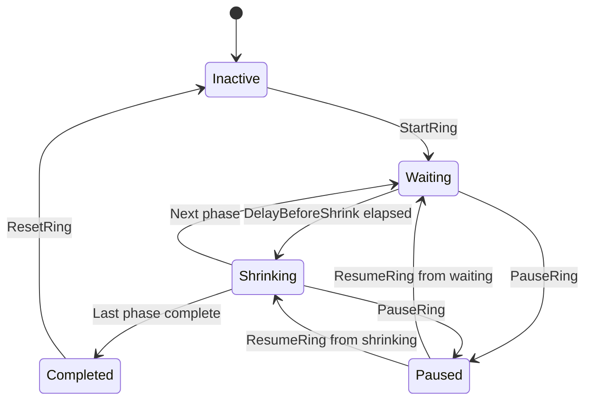
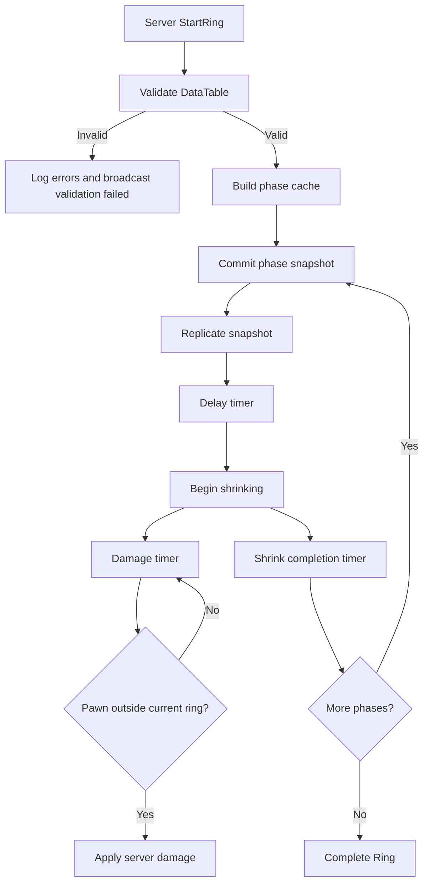

# Ring Component Research Report

Terminology note: this file keeps the historical `zone_component_research.md` filename for harness compatibility, but the implementation and user-facing term is `Ring`.

## Executive Summary

현재 저장소에는 Jun 담당 영역으로 `JunRingComponent`, `JunRingActor`, `JunDeathmatchGameMode`, `JunDeathmatchGameState`가 이미 추가되어 있다. 방향 자체는 "자기장을 데스매치에서 분리해서 재사용 가능하게 만든다"는 목표에 맞지만, 새 Ring 요구사항 기준으로는 아직 설계가 충분하지 않다.

가장 중요한 보완점은 세 가지다. 첫째, GameMode는 서버 전용이므로 UI나 클라이언트 로직이 GameMode 상태를 직접 읽는 구조를 피해야 한다. 둘째, Ring은 데스매치뿐 아니라 round-based team elimination과 다른 GameMode에서도 재사용되어야 하므로, 런타임 상태를 GameMode에 묶지 않는 설계가 필요하다. 셋째, 클라이언트에는 데미지 결과나 복잡한 내부 계산이 아니라 현재 phase, center, radius, target, started/paused/shrinking 같은 최소 스냅샷만 복제해야 한다.

현재 추천 아키텍처는 기존 `AJunRingActor + UJunRingComponent`를 강화하는 방식이다. GameMode는 서버 권한 orchestration만 담당하고, replicated Ring actor/component가 client-visible snapshot을 제공한다.

## Confirmed Facts

- `WP_4th.uproject`가 존재하며 `EngineAssociation`은 `5.7`로 기록되어 있다.
- 런타임 모듈 이름은 `WP_4th`다.
- 기존 무기 데이터는 `Source/WP_4th/Weapon/WeaponData.h`에서 `FTableRowBase` 기반 DataTable 구조를 사용한다.
- 기존 Jun 작업은 `Source/WP_4th/JunGame` 아래에 위치한다.
- 현재 Jun Ring 관련 파일은 `JunRingComponent`, `JunRingActor`, `JunDeathmatchGameMode`, `JunDeathmatchGameState`, `JunDeathmatchPlayerState`, `JunBalanceData` 등이다.
- 현재 `JunRingComponent`는 서버 권한에서 phase/radius를 갱신하고, DataTable 기반 phase row를 읽는 방향으로 작성되어 있다.

## Repo Findings

### Existing Gameplay Framework

저장소에는 기본 템플릿 계열 `WP_4thGameMode`, `WP_4thPlayerController`, 캐릭터 계열 `ApexCharacterBase`, 테스트용 `WeaponTestGameMode`, Jun 전용 `JunDeathmatchGameMode`가 있다. 즉 하나의 공통 GameMode 계층이 이미 강제되어 있다고 보기는 어렵다.

이 점 때문에 Ring을 특정 GameMode 상속 구조에 직접 묶는 방식은 장기 재사용에 불리하다.

### Existing Data Pattern

무기 시스템의 `FWeaponData`는 `FTableRowBase`를 상속하고 `UDataTable`을 통해 값을 읽는 구조다. Ring phase도 같은 패턴을 따르는 것이 저장소 일관성에 맞다.

### Existing Network Pattern

기존 문서와 코드 흐름상 데미지, 사망, 리스폰, 매치 진행은 서버 권한으로 처리하는 방향이다. Ring 역시 phase 전환과 데미지는 서버에서만 실행하고, 클라이언트는 복제된 snapshot을 읽는 방식이 맞다.

## External Research

### GameMode / GameState

Unreal 공식 문서에 따르면 GameMode는 게임 규칙을 정의하고 서버에만 존재한다. 원격 클라이언트는 실제 GameMode 인스턴스에 접근해 변경 상태를 읽을 수 없으므로, 클라이언트에 필요한 게임 진행 정보는 GameState에 보관하고 복제해야 한다. 같은 문서에서 GameState는 연결된 클라이언트가 게임 상태를 모니터링할 수 있도록 복제되는 Actor라고 설명한다. 또한 `AGameStateBase::GetServerWorldTimeSeconds`는 서버 시간 기준 동기화에 사용할 수 있는 값이다. Source: [Game Mode and Game State in Unreal Engine](https://dev.epicgames.com/documentation/en-us/unreal-engine/game-mode-and-game-state-in-unreal-engine?application_version=5.6)

이 근거는 Ring UI가 GameMode를 읽지 않고 GameState 또는 replicated Ring actor snapshot을 읽어야 한다는 결론을 뒷받침한다.

### ActorComponent Replication

Unreal 공식 문서에 따르면 ActorComponent는 기본적으로 복제되지 않으며, 복제하려면 소유 Actor가 replicate되어야 하고 Component 자체도 replicate되도록 설정해야 한다. 정적 컴포넌트는 Actor constructor에서 `CreateDefaultSubobject`로 만들고, Component constructor에서 `SetIsReplicatedByDefault(true)`를 설정하는 흐름이 제시되어 있다. Source: [Replicating Actor Components in Unreal Engine](https://dev.epicgames.com/documentation/ar-ar/unreal-engine/replicating-actor-components-in-unreal-engine)

이 근거는 `UJunRingComponent`를 replicated Ring actor에 붙이는 설계가 가능함을 보여준다. 다만 UI가 Component에 직접 의존하기보다 Actor나 GameState가 제공하는 snapshot getter를 읽는 편이 더 안정적이다.

### DataTable / CSV

Unreal 공식 Data Driven Gameplay 문서는 DataTable이 CSV로 import될 수 있고, row 구조체가 `FTableRowBase`를 상속해야 하며, CSV 첫 column은 row name 역할을 하는 `Name`이어야 한다고 설명한다. Source: [Data Driven Gameplay Elements in Unreal Engine](https://dev.epicgames.com/documentation/ja-jp/unreal-engine/data-driven-gameplay-elements-in-unreal-engine)

또한 `UDataTableFunctionLibrary::FillDataTableFromCSVFile` 문서는 CSV 파일로 DataTable을 채우는 editor scripting API를 제공하며 실패 시 log를 확인해야 한다고 설명한다. Source: [UDataTableFunctionLibrary::FillDataTableFromCSVFile](https://dev.epicgames.com/documentation/en-us/unreal-engine/API/Runtime/Engine/Kismet/UDataTableFunctionLibrary/FillDataTableFromCSVFile)

이 근거는 Ring balancing의 1차 경로를 CSV -> DataTable asset으로 두는 결정을 뒷받침한다. Packaged runtime에서 임의 CSV hot reload를 기본 요구로 잡는 것은 별도 File I/O 설계 없이는 위험하다.

## Assumptions

- 현재 사용자는 Jun 담당 영역 안에서 Ring/Deathmatch를 계속 작업할 계획이다.
- round-based team elimination mode는 아직 구체 클래스가 없거나, 최소한 현재 대화에서 파일명이 확정되지 않았다.
- UI 구현은 아직 확정되지 않았으므로, UI-facing API는 Blueprint getter/event 중심으로 설계한다.
- 외부 CSV runtime hot reload는 현재 필수 기능이 아니라 design-time/editor balancing workflow로 본다.

## Architecture Options

### Option A: GameMode Authority Component + GameState Mirror

GameMode 또는 GameModeBase subclass에 authority component를 붙이고, client-visible runtime state를 GameState로 mirror한다.

장점:

- GameMode가 round orchestration을 담당하므로 호출 흐름이 직관적이다.
- GameState에 UI snapshot을 두면 Unreal multiplayer framework와 잘 맞는다.

단점:

- ActorComponent를 GameMode에 붙이는 것은 클라이언트 복제 경로로 직접 쓰기 어렵다.
- 여러 GameMode가 각자 GameState mirror field를 구현해야 할 수 있다.
- Ring 시스템을 독립 feature로 재사용하기 어렵다.

### Option B: GameMode Orchestration + Dedicated Replicated Ring Actor

GameMode는 Ring actor를 spawn/register/start/pause/reset하고, dedicated replicated Ring actor가 runtime snapshot을 소유한다. Ring actor 내부에는 core logic component를 둔다.

장점:

- GameMode 간 재사용성이 높다.
- UI는 replicated Ring actor의 snapshot만 읽으면 된다.
- 서버 권한과 클라이언트 가시 상태가 명확히 분리된다.
- 기존 `AJunRingActor + UJunRingComponent` 방향과 가장 자연스럽게 이어진다.

단점:

- Actor lifecycle 관리가 추가된다.
- GameState에서 Ring actor reference를 노출할지, UI가 actor discovery를 할지 결정이 필요하다.

### Option C: Repo-Specific GameState Interface

`UInterface`로 Ring snapshot provider/consumer contract를 만들고, 각 GameState가 이를 구현한다.

장점:

- GameMode/GameState pairing을 엄격하게 유지할 수 있다.
- UI가 interface만 바라보도록 설계 가능하다.

단점:

- 현재 저장소에 강한 공통 GameState 계층이 없어서 초기 설계량이 늘어난다.
- 아직 UI 구조가 확정되지 않아 interface가 조기 과설계가 될 수 있다.

## Recommendation

Option B를 선택한다.

선택 이유:

- Unreal multiplayer semantics상 GameMode는 서버 전용이고, 클라이언트 UI는 복제된 Actor 또는 GameState를 읽어야 한다.
- Ring은 데스매치뿐 아니라 round-based team elimination mode에도 붙어야 하므로 GameMode subclass에 직접 묶지 않는 편이 낫다.
- 현재 Jun 코드의 `AJunRingActor + UJunRingComponent` 흐름을 `AJunRingStateActor + UJunRingComponent`로 확장하기 쉽다.
- Damage, phase transition, pause/resume 권한은 서버에 남기고, snapshot만 복제하는 구조가 명확하다.

## Proposed Runtime Ownership

- GameMode: round start/stop/reset, Ring actor spawn, server-only orchestration
- Ring Actor: replicated runtime snapshot owner, UI-readable public getters
- Ring Component: core server-side phase progression, validation, damage application
- GameState: optional reference to current Ring actor, team/round state integration
- UI: GameState에서 Ring actor reference를 얻거나, assigned Ring actor snapshot getter를 읽음

## Replication Snapshot

최소 복제 필드는 다음이다.

- `CurrentPhase`
- `ElapsedInPhase`
- `PhaseState`
- `CurrentCenter`
- `TargetCenter`
- `CurrentRadius`
- `TargetRadius`
- `bIsActive`
- `bIsPaused`
- `bIsShrinking`
- `ServerWorldTimeAtPhaseStart`

데미지 결과, 매 tick마다 계산한 pawn list, 내부 timer handle, validation error cache는 복제하지 않는다.

## DataTable / CSV Approach

기본 authoring path:

1. Designer edits CSV in spreadsheet tool.
2. Unreal Editor imports/reimports CSV as DataTable.
3. Ring component initializes from DataTable asset.
4. Validation logs readable errors and refuses to start when invalid.

Runtime reload policy:

- Editor: DataTable reimport or editor scripting path is acceptable.
- Packaged runtime: cooked DataTable asset reference is the default.
- Live CSV reload: not included by default; requires explicit File I/O path and platform policy.

## Mermaid: State Flow

## Mermaid: Phase Timeline

```mermaid
gantt
    title Ring Phase Timeline
    dateFormat X
    axisFormat %s
    section Phase 0
    Warning/Delay :0, 10
    Shrink        :10, 20
    Damage Ticks  :0, 30
    section Phase 1
    Warning/Delay :30, 8
    Shrink        :38, 16
    Damage Ticks  :30, 24
```

## Mermaid: Shrink Progression Flow

## Test Priorities

1. Invalid CSV/DataTable refuses to start and logs readable errors.
2. Client calls cannot author phase progression.
3. Server starts Ring and clients receive snapshot.
4. Pause/Resume changes snapshot and stops damage/progression.
5. Phase order is deterministic by `Phase`.
6. Center/radius interpolation is deterministic from server time.
7. Damage applies only on server and only outside ring.
8. Round reset returns Ring to inactive baseline.
9. UI can read snapshot without touching GameMode.
10. Packaged build behavior is documented as cooked DataTable asset based.

## Risks And Open Questions

- Current `JunRingComponent` may be easier to replace with `JunRingComponent` than to mutate in place.
- Dedicated Ring actor requires lifecycle rules: who spawns, who owns, who exposes reference to UI.
- Current build/test command availability is not confirmed because local Unreal toolchain path is not configured in this shell.
- Existing Jun docs contain older Ring wording and should be gradually aligned after architecture approval.
